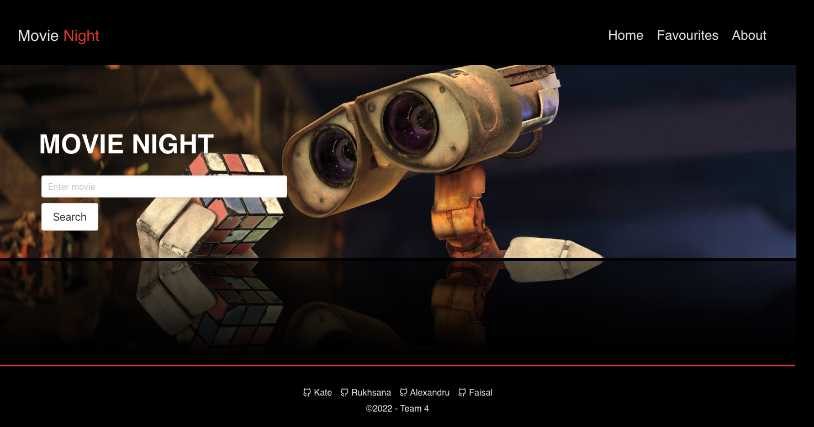
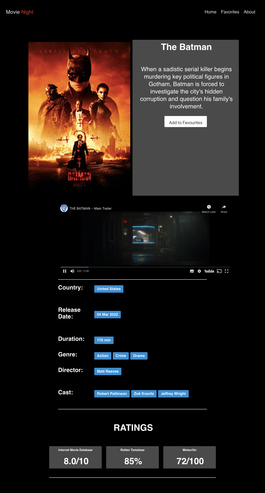
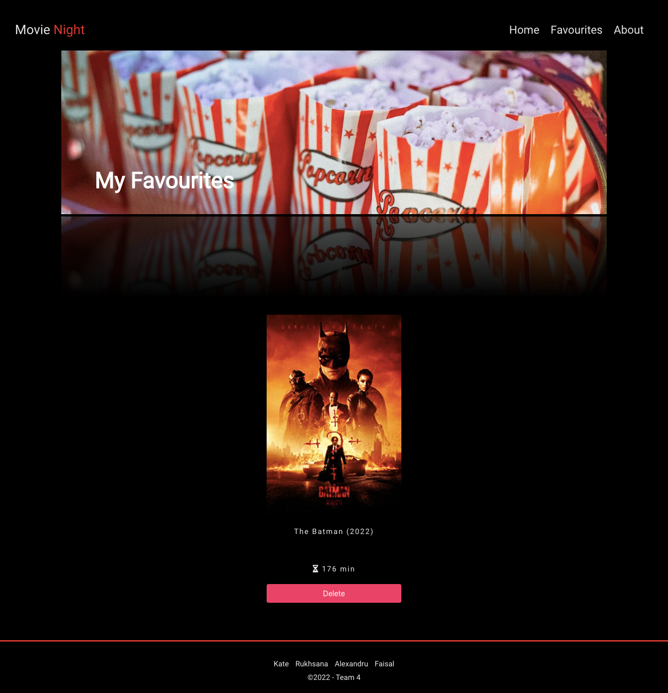
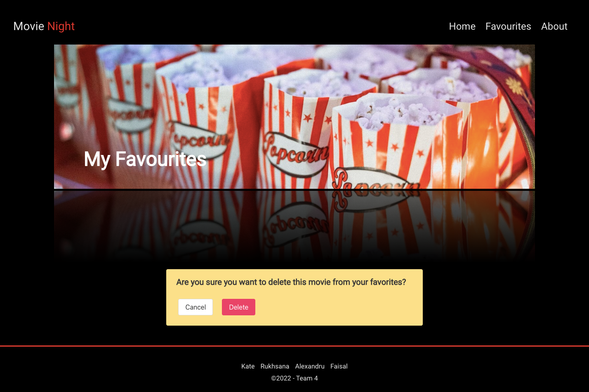
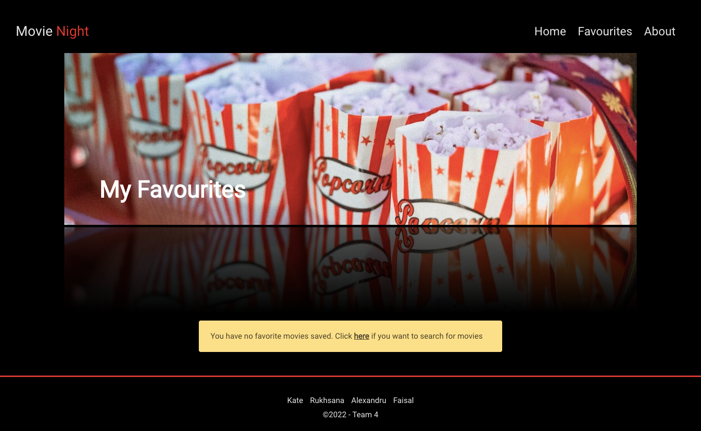
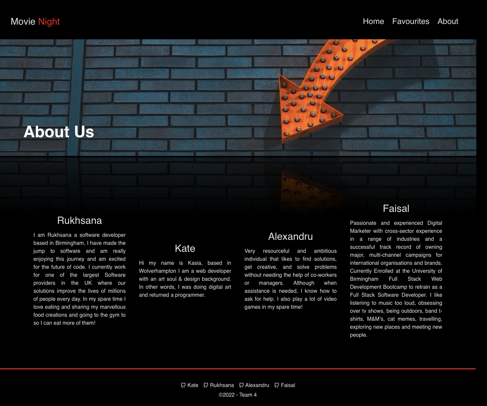

# Project Title

Movie Night

# User Journey

A website where the user can search for any movie using the search bar. The user is presented with several movies which are called from the API and rendered onto the screen.

The user can click on any movie card which is presented to them and then another window pops up showcasing more information about the chosen movie.

The pop up screen presents a larger image of the movie along with the synopsis, country, release date, duration, genre, director, cast and ratings.
On the synopsis section the user has options to click on a view trailer button and/or add to favourites button.

The YouTube API is triggered to get the requests for the trailer title is rendered and starts to play the traileronce the viewer is on their movie. The viewer can watch the trailer and decide if they would like to Add to Favourites button which will store their favourite movie into local storage.

When the user navigates to the Favourites page all their favourite movies are rendered from the local storage with an option to delete the movies if desired.
A notification is rendered as a safety measure to give the user some notice with options to go ahead with the delete or cancel the option to delete.

If the user chooses the delete button the movie is removed from their favourites page. If the user clicks cancel, the notification is removed. When the user has no favourites stored on their page there is an alert box which states that the user does not have any favourite movies saved.

We have included an About us Page which contains a small description of ourselves along with links to our GitHub pages.

# Languages Libraries Used

We have used HTML ,CSS, JavaScript along with the Bulma framework, Unicon library for icons and the JQuery library to add event listeners and render our pages dynamically.

# Link to URL

Click on the link to visit the website
[here](https://talexandru1987.github.io/group-4-project-1/)

# Screenshots

# Mini Demo

Watch the demo to see the user journey.
[Movi Night Demo](https://drive.google.com/file/d/1Pe3my6cmiuIXoFwEPB1b0v_PkAwflp2O/view)
